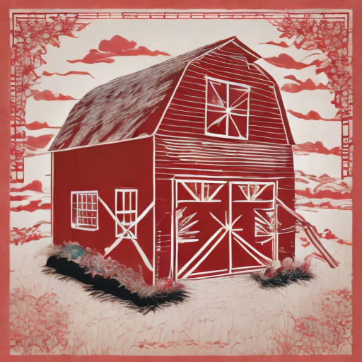
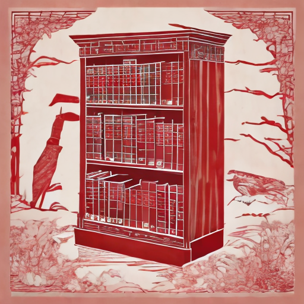
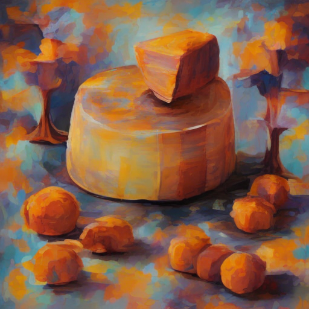
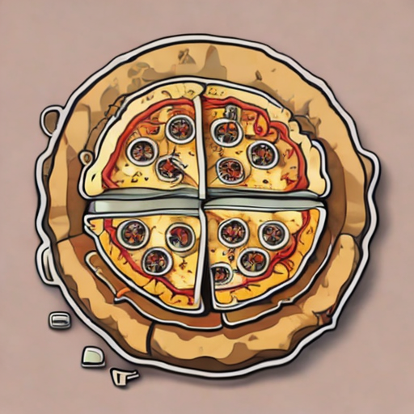
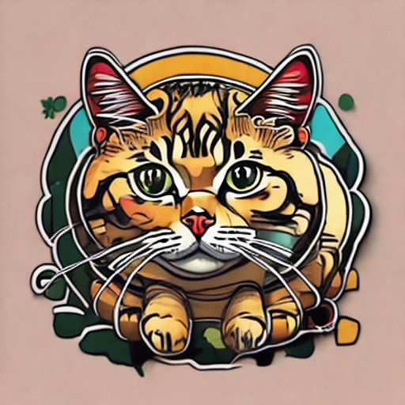

# Jittor 赛题二图像风格迁移B榜审查
<!-- | 标题名称包含赛题、方法 -->
<div style="display: flex; align-items: center;">
  
  
  
  
  
  
  
  
  
  
</div>
<!--  -->
<!-- ｜展示方法的流程特点或者主要结果等 -->

## 简介
<!-- | 简单介绍项目背景、项目特点 -->

本项目包含了第四届计图挑战赛 - 图像风格迁移比赛B榜的代码实现。本项目的特点是：
1. 基于DreamBooth-Lora微调方法，使用StableDiffusion v2.1作为底模，对clip的text encoder模块和Unet模型进行了微调。
2. 对特定类别的训练提示词和生成提示词进行了设计；对特定的类别使用了反向提示词。
3. 使用VAE的encoder从图像中获取风格表示，通过加权方式增强prompt经过clip之后的特征。
4. 对unet和text_encoder的学习率参数进行了细致的调整。

## 方法介绍
我们使用Lora微调方法对unet和clip的text encoder结构的部分线性层的权重矩阵进行了微调，lora的秩均为4。具体的微调结构如下：
1. unet网络中的BasicTransformer模块的SelfAttention和CrossAttention用于计算k,q,v的线性层和输出的线性层、FeedForward模块的GEGIU的线性层
2. clip text encoder中SelfAttention模块用于计算k,q,v的线性层和输出的线性层


训练与推理过程中使用prompt的格式为`"<画面描述>，<风格类型>"`，训练过程的`<画面描述>`直接使用图像文件名，测试过程的`<画面描述>`使用测试提供的json文件中的内容；风格类型描述使用`style`+`数字`，如`stytle00`、`stytle01`。

为使用VAE Encoder进行prompt特征增强，首先我们用VAE Encoder提取同一风格不同图像在潜在空间的均$\mu_i$与方差$\sigma_i$，取均值与方差的平均值$\bar{\mu}$、$\bar{\sigma}$做为对应风格在潜在空间的表示$f_{img}$，$f_{img}$由$\bar{\mu}$、$\bar{\sigma}$拼接得到。之后将$f_{img}$输入两层卷积网络完成通道数与分辨率的调整，最后通过加权的方式得到对prompt特征$f_{text}$的增强结果$f_{strength}$，其中$f_{img}$的权重为0.01。公式表示如下：
$$f_{strength}=0.01*Conv(Conv(cat(\bar{\mu}, \bar{\sigma}))) + f_{text}$$

我们探索了不同模块不同的学习率对生成结果的影响，同一风格不同的数据数目与风格对学习率的设置存在较大的差异。
- A榜中：unet部分的学习率为$1e^{-4}$，clip text encoder部分的学习率为$6e^{-5}$，卷积模块的学习率为$1e^{-4}$；
- A榜中：unet部分的学习率为$4e^{-5}$，clip text encoder部分的学习率为$3e^{-5}$，卷积模块的学习率为$1e^{-3}$；


## 安装 
<!-- | 介绍基本的硬件需求、运行环境、依赖安装方法 -->

<!-- 本项目可在 2 张 4090 上运行，训练时间约为 1 小时。 -->

#### 运行环境
- ubuntu 20.04 LTS
- python >= 3.9
- jittor >= 1.3.9

#### 安装依赖
执行以下命令安装 python 依赖
```
pip install -r requirements.txt
```

#### 预训练模型
`B_weight`文件夹中保存的是B榜风格对应的lora和prompt特征增强使用的权重

<!-- ## 数据预处理
| 介绍数据预处理方法，可选

将数据下载解压到 `<root>/data` 下，执行以下命令对数据预处理：
```
bash scripts/prepross.sh
``` -->

## 训练
<!-- ｜ 介绍模型训练的方法 -->
训练可运行以下命令：
```
bash train_text_unet_ip_vae_encode.sh 
```

<!-- 多卡训练可以运行以下命令：
```
bash scripts/train-multigpu.sh
``` -->

## 推理
<!-- ｜ 介绍模型推理、测试、或者评估的方法 -->
生成测试集上的结果可以运行以下命令：

```
python run_all_text_ip_one_style
```
默认是进行`train_text_unet_ip_vae_encode.sh`训练权重的生成。


## 其他说明
`train_all.sh`是只对unet和clip text encoder进行lora微调的训练脚本，`run_all_text.py`是对应的测试脚本；`test.py`文件是复现测试结果的代码，代码的运行要求生成包含每张图对应的随机种子的json文件，在推理过程中只是生成了txt文件，所以需要自行转换一下，转换的方式可参考`convert_txt_json.py`（在B_weight中已经完成了转换）
<!-- 可将`tesh_all.sh`中的第`4`行脚本改为`COMMAND="CUDA_VISIBLE_DEVICES=$CUDA_VISIBLE_DEVICES python run_all_text_ip_addpter_add_text.py` -->

<!-- ## 致谢
| 对参考的论文、开源库予以致谢，可选

此项目基于论文 *A Style-Based Generator Architecture for Generative Adversarial Networks* 实现，部分代码参考了 [jittor-gan](https://github.com/Jittor/gan-jittor)。

## 注意事项

点击项目的“设置”，在Description一栏中添加项目描述，需要包含“jittor”字样。同时在Topics中需要添加jittor。

 -->
